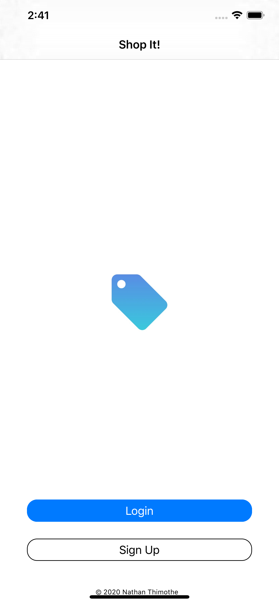
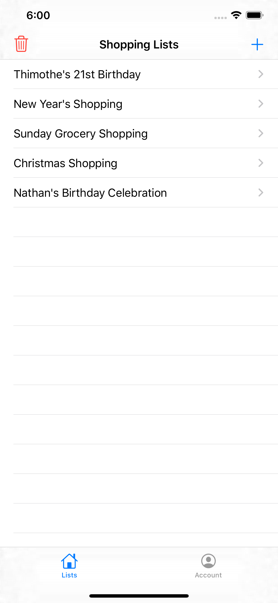
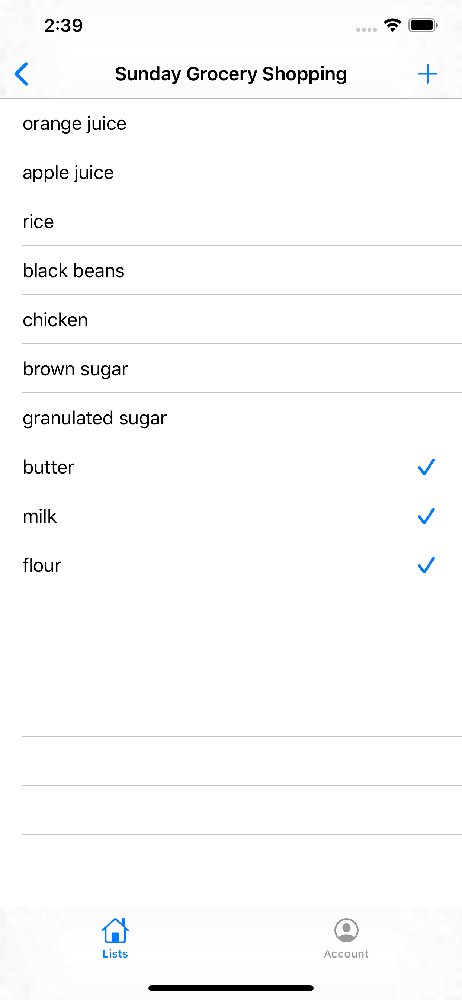
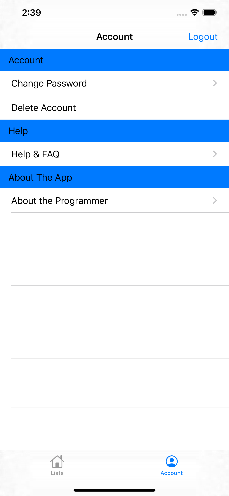

# ShopIt

ShopIt is a simple iOS app (created for iOS 13+ and iPhone X+) that allows a user to keep track of their quotidian shopping lists across iOS devices.

## Running the App

ShopIt can be opened in Xcode and deployed to an iOS device just like an other app, but there are a few steps that need to be completed first:

• Download and install [Cocoapods](http://cocoapods.org/)  
• From the root directory, run the following command in terminal:
`pod install`  
• Open up the .xcworkspace file, and deploy to your device!

## Screenshots

 
 
